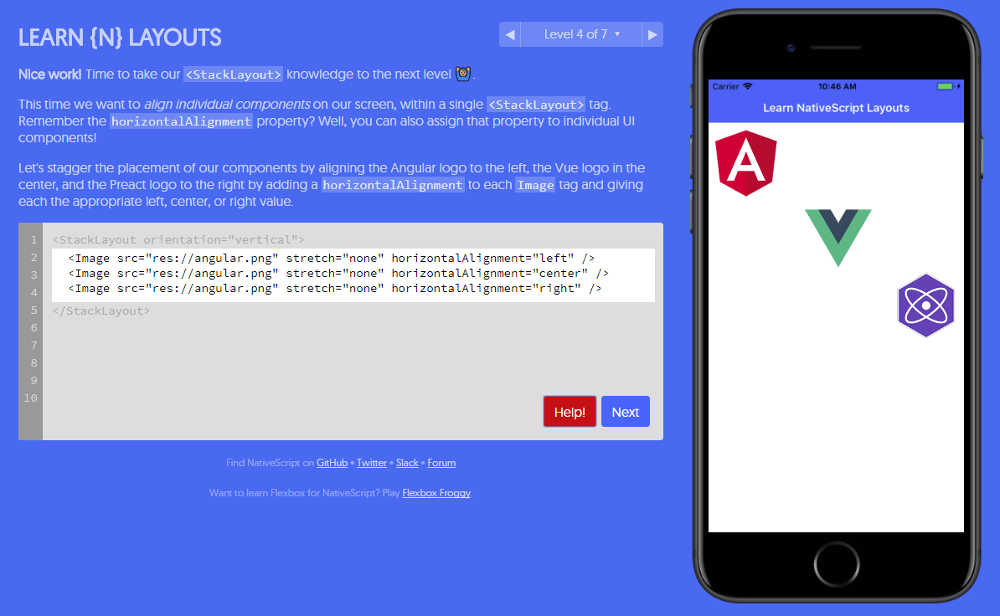

# Learn NativeScript Layouts

Inspired by [Flexbox Froggy](http://flexboxfroggy.com/), this is a fun and easy way for you to learn about iOS and Android mobile app layouts with [NativeScript](https://www.nativescript.org). Each level presents a different mobile app view that needs native UI elements laid out a certain way. NativeScript provides a variety of [layout containers](https://docs.nativescript.org/ui/layouts/layout-containers) to help with this:

* StackLayout
* WrapLayout
* AbsoluteLayout
* GridLayout
* DockLayout
* FlexboxLayout

**Check the lessons out at [nslayouts.com](https://www.nslayouts.com/).**

## License

MIT
